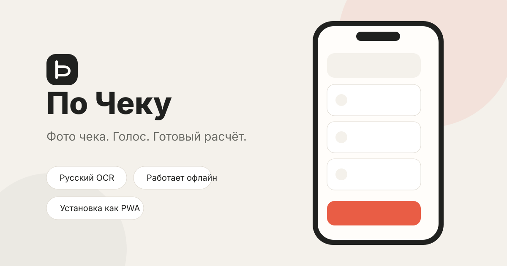

# По Чеку



Мобильное PWA-приложение для разделения ресторанного счёта: сфотографируйте чек, распределите позиции голосом или касанием и получите точную сумму для каждого.

[Открыть приложение](https://srgtm.github.io/splitbill/)

## Возможности

- распознавание русских и английских чеков прямо в браузере;
- распознавание количества, модификаторов и построчных скидок;
- распределение позиций касанием или русскими голосовыми командами;
- корректная работа с копейками без ошибок округления;
- установка на домашний экран iPhone и Android;
- офлайн-запуск после первого открытия;
- фотографии чеков не загружаются на сервер.

## Установка

### iPhone и iPad

1. Откройте [приложение](https://srgtm.github.io/splitbill/) в Safari.
2. Нажмите **Поделиться**.
3. Выберите **На экран «Домой»**.
4. Нажмите **Добавить**.

### Android

1. Откройте [приложение](https://srgtm.github.io/splitbill/) в Chrome.
2. Нажмите **Установить** в шапке приложения или выберите **Установить приложение** в меню браузера.
3. Подтвердите установку.

### Компьютер

Chrome и Edge предлагают установку через значок в адресной строке или кнопку **Установить** внутри приложения.

## Как пользоваться

1. Сфотографируйте чек без бликов.
2. Проверьте распознанные позиции и цены.
3. Переименуйте участников.
4. Нажмите на имя возле каждой позиции или скажите, например:
   - «Пиво у Маши, коктейли на всех»;
   - «Редкая прожарка у Маши»;
   - «Вегетарианский бургер у Саши».
5. Нажмите **Рассчитать доли**.

Кнопка **Открыть пример настоящего чека** загружает демонстрационный счёт на 2 464 ₽ с количеством, модификаторами и скидками.

## Конфиденциальность

Изображение обрабатывается локально в браузере с помощью Tesseract.js. Приложение не имеет сервера, базы данных или аналитики и не отправляет фотографию чека владельцу репозитория. Для загрузки OCR-модели браузер обращается к публичному CDN.

## Локальный запуск

```bash
python3 -m http.server 8080
```

Откройте <http://localhost:8080>. Камера, микрофон, Service Worker и установка PWA требуют безопасного контекста: HTTPS либо `localhost`.

## Разработка

Проект не требует сборщика и package manager. Проверка:

```bash
node scripts/check.mjs
```

Публикация в GitHub Pages выполняется автоматически workflow из `.github/workflows/pages.yml` после push в `main`.

## Ограничения

- качество OCR зависит от освещения, резкости и структуры чека;
- голосовой ввод зависит от поддержки Web Speech API браузером;
- распознанные позиции и суммы следует проверить перед расчётом.

## Лицензия

[MIT](LICENSE) © 2026 srg
